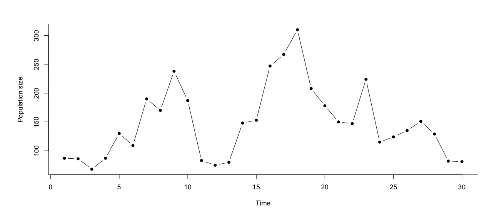
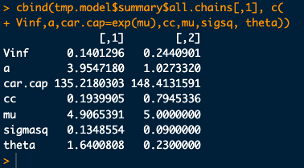
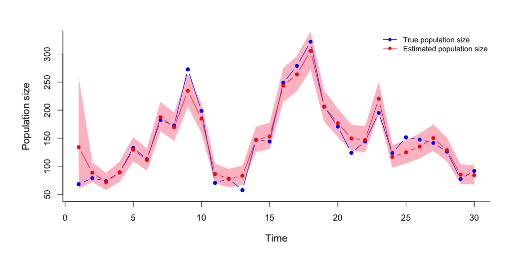
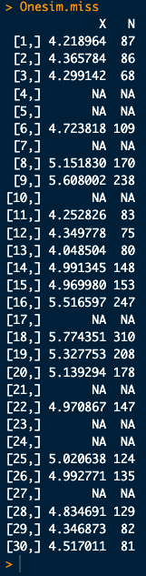
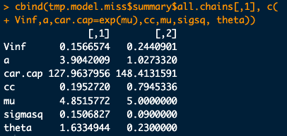
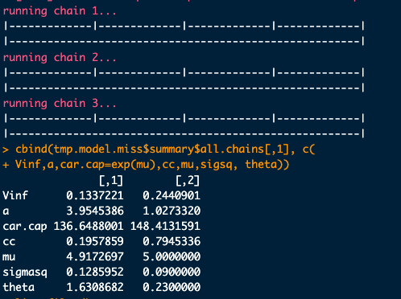
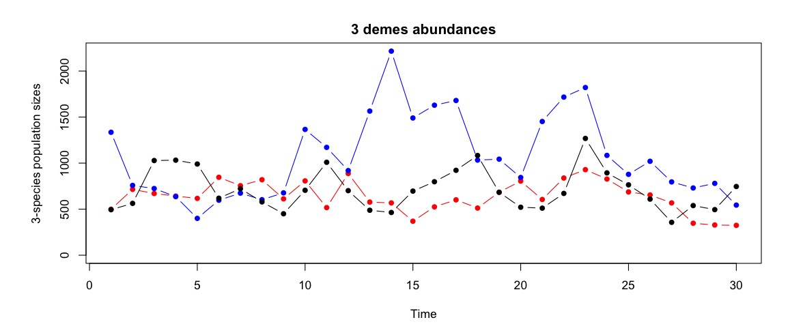
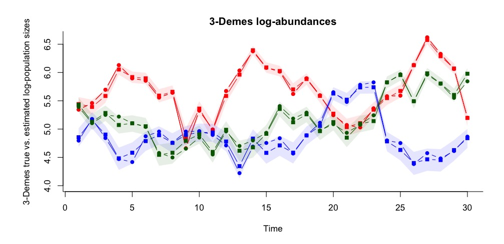

# Part 1:  A simple one-population Stochastic Gompertz with unequal sampled intervals

First we load the file with the Nimble functions
```{r eval=FALSE, echo=TRUE}
source("GompertzinNimble-NAs.R")
```


Now, let's simulate data.  We begin with simulate data from one population, with no missing data (equal sampling intervals) and Poisson sampling error

```{r eval=FALSE, echo=TRUE}

mu <- 5
theta <- 0.23
sigsq <- 0.09

cc <- exp(-theta)
a <- mu*(1-cc)
Vinf <- sigsq/(1-cc^2)

len <- 30
Onesim <- Pois.gssm(pars=c(mu=mu, theta=theta, sigsq=sigsq), len=len)
plot(1:len, Onesim[,2], pch=16, type="b", xlab="Time", ylab="Population size", bty="l")
```



Next, we do Maximum Likelihood estimation via Data Cloning and MCMC
```{r eval=FALSE, echo=TRUE}
ncl <- 30
data <- list(N=nimMatrix(Onesim[,2], nrow= nrow(Onesim), ncol=ncl))
constants <- list(qp1 = nrow(Onesim), ncl=ncl)
monitors <- c("mu", "theta", "sigmasq", "a", "cc", "car.cap", "Vinf")
inits <- list(lmu = log(4), ltheta=log(0.5), lsigmasq=log(0.1))

tmp.model <- nimbleMCMC( code=GSSM, data = data, 
                         constants=constants, inits = inits,
                         monitors = monitors, thin = 10,
                         niter = 50000, nburnin = 10000, nchains = 3,
                         summary = TRUE, samplesAsCodaMCMC = TRUE)
cbind(tmp.model$summary$all.chains[,1], c(
Vinf,a,car.cap=exp(mu),cc,mu,sigsq, theta))

#tmp.model$summary$all.chains
```

And now we compare the results (the means of the MCMC chains, which should be equal to the ML estimates) with the true values (MLEs on the left column, true values on the right column):
```{r eval=FALSE, echo=TRUE}

cbind(tmp.model$summary$all.chains[,1], c(
Vinf,a,car.cap=exp(mu),cc,mu,sigsq, theta))

```


Alright!  It seems this is working fairly decently.  Note that I have not increased the number of clones or the length of the MCMC chains. Now let's get the Kalman estimates of the true, un-observed population sizes:

```{r eval=FALSE, echo=TRUE}

data <- list(N=Onesim[,2])
constants <- append( as.list(tmp.model$summary$all.chains[,1]),  constants)

gss.kalman <- nimbleMCMC( code=GSSM.kalman, data = data, 
                         constants=constants, 
                         monitors = c("Nhid"), thin = 10,
                         niter = 50000, nburnin = 10000, nchains = 3,
                         summary = TRUE,
                         dimensions = list(Nhid = length(Onesim[,2])))

N.hat <-  gss.kalman$summary$all.chains[,1]
N.low <-  gss.kalman$summary$all.chains[,4]
N.hi <-  gss.kalman$summary$all.chains[,5]

par(oma=c(1,1,1,1), mar=c(4,5,2,1))
plot(1:len, exp(Onesim[,1]), pch=16, type="b", xlab="Time", ylab="Population size", bty="l",
     ylim=range(Onesim[,2]) + c(-20,+20), col="blue", cex.lab=1.15)
polygon(c(1:len,rev(1:len)), c(N.low,rev(N.hi)), col="pink", border=NA)
points(1:len, exp(Onesim[,1]), pch=16, type="b", col="blue")
points(1:len, N.hat, pch=16, type="b", col="red")
legend("topright", legend=c("True population size", "Estimated population size"),
       col=c("blue", "red"), pch=c(16,16), lty=c(1,1), cex=0.85, bty="n")

```


Now we are ready to take into account "missing" data to effectively deal with unequal sampled intervals.  We will remove 30 percent of the data at random:

```{r eval=FALSE, echo=TRUE}

nainds <- sample(1:len, size=round(0.3*len))

Onesim.miss <- Onesim
Onesim.miss[nainds,] <- NA
print(Onesim.miss)

```


Now, let's take advantage of Nimble's ability to automatically detect NAs and do its job properly

```{r eval=FALSE, echo=TRUE}
ncl <- 30
data.miss <- list(N=nimMatrix(Onesim.miss[,2], nrow= nrow(Onesim.miss), ncol=ncl))
constants <- list(qp1 = nrow(Onesim.miss), ncl=ncl)
monitors <- c("mu", "theta", "sigmasq", "a", "cc", "car.cap", "Vinf")
inits <- list(lmu = log(4), ltheta=log(0.5), lsigmasq=log(0.1))

tmp.model.miss <- nimbleMCMC( code=GSSM, data = data.miss, 
                         constants=constants, inits = inits,
                         monitors = monitors, thin = 10,
                         niter = 50000, nburnin = 10000, nchains = 3,
                         summary = TRUE, samplesAsCodaMCMC = TRUE)
#tmp.model$summary$all.chains

cbind(tmp.model.miss$summary$all.chains[,1], c(
Vinf,a,car.cap=exp(mu),cc,mu,sigsq, theta))

```


It does work well.  The secret is to provide good initial values, so it seems that the best thing to do is to use 'ROUSSE-2.0.R'.  The `guess.calc' function from 'ROUSSE-2.0.R' requires providing a vector of the time at which the observations were done

```{r eval=FALSE, echo=TRUE}
guess.calc <- function(Yobs,Tvec){
	
	T.t <-Tvec-Tvec[1]; #  For calculations, time starts at zero.
	q <- length(Yobs)-1;      #  Number of time series transitions, q.
	qp1 <- q+1;              #  q+1 gets used a lot, too.
	S.t <- T.t[2:qp1]-T.t[1:q];  #  Time intervals.
	Ybar <- mean(Yobs);
	Yvar <- sum((Yobs-Ybar)*(Yobs-Ybar))/q;
	mu1 <- Ybar;

	# Kludge an initial value for theta based on mean of Y(t+s) given Y(t).
	th1<- -mean(log(abs((Yobs[2:qp1]-mu1)/(Yobs[1:q]-mu1)))/S.t);            
	bsq1<- 2*th1*Yvar/(1+2*th1);         # Moment estimate using stationary
	tsq1<- bsq1;                         #   variance, with betasq=tausq.

	#three 0's 
	three0s <- sum(c(th1,bsq1,tsq1))
	if(three0s==0|is.na(three0s)){th1 <- 0.5;bsq1 <- 0.09; tsq1 <- 0.23;}

	
	out1 <- c(th1,bsq1,tsq1);
	if(sum(out1<1e-7)>=1){out1 <- c(0.5,0.09,0.23)}
	out <- c(mu1,out1);
	return(abs(out))
	
}

#Let's wrap this initial guess estimator function into another function 
#that takes into account possible NAs

guess.calc2.0<- function(TimeAndNs){
  
  newmat <- TimeAndNs # to be replaced if is.na ==TRUE
  isnas <- sum(is.na(TimeAndNs))
  
  if(isnas >= 1){
    
    isnaind <- which(is.na(TimeAndNs[,2]), arr.ind=TRUE)
    newmat <- TimeAndNs[-isnaind,]
    newmat[,1] <- newmat[,1] - newmat[1,1]

  }
  
  init.guess <- guess.calc(Yobs = log(newmat[,2]), Tvec=newmat[,1])
  
  mu1  <- init.guess[1]
  th1  <- init.guess[2]
  bsq1 <- init.guess[3]
  sigsq1<- ((1-exp(-2*th1))*bsq1)/(2*th1)
  
  out <- c(mu=mu1, theta=th1, sigmasq = sigsq1)
  return(out)
}


```
Then I added the vector of times as the output of the simulated data, to have the time vector handy:
```{r eval=FALSE, echo=TRUE}
mu <- 5
theta <- 0.23
sigsq <- 0.09

cc <- exp(-theta)
a <- mu*(1-cc)
Vinf <- sigsq/(1-cc^2)

len <- 30
Onesim <- Pois.gssm(pars=c(mu=mu, theta=theta, sigsq=sigsq), len=len, T.out=TRUE)

print(Onesim)

# And with 30% missing:
nainds <- sample(1:len, size=round(0.3*len))

Onesim.miss <- Onesim
Onesim.miss[nainds,] <- NA

```

Now let's get new automatic initial values and run a naive MCMC to see if it gets stuck
```{r eval=FALSE, echo=TRUE}

naive.guess <- guess.calc2.0(TimeAndNs = Onesim.miss[,-2])
inits <- list(lmu = log(naive.guess[1]), ltheta=log(naive.guess[2]), lsigmasq=log(naive.guess[3]))

ncl <- 50
# Watch it: now the N abundance data is COLUMN 3 !!!!
data.miss <- list(N=nimMatrix(Onesim.miss[,3], nrow= nrow(Onesim.miss), ncol=ncl))
constants <- list(qp1 = nrow(Onesim.miss), ncl=ncl)
monitors <- c("mu", "theta", "sigmasq", "a", "cc", "car.cap", "Vinf")


tmp.model.miss <- nimbleMCMC( code=GSSM, data = data.miss, 
                         constants=constants, inits = inits,
                         monitors = monitors, thin = 10,
                         niter = 50000, nburnin = 10000, nchains = 3,
                         summary = TRUE, samplesAsCodaMCMC = TRUE)
#tmp.model$summary$all.chains
```
An d the moment of truth:

```{r eval=FALSE, echo=TRUE}
cbind(tmp.model.miss$summary$all.chains[,1], c(
Vinf,a,car.cap=exp(mu),cc,mu,sigsq, theta))

```
Alright, it doesn't get stuck!




## Multiple demes: the multivariate Gompertz state-space model

The first step is to create a multiple population simulator using a joint density-dependent Gompertz model with migration.  If for example, you have 3 demes, then the equation of population chagne for each deme is:

$$
N_{t+1}^{(i)} = N_{t}^{(i)}\times\exp\left\{a_{i} + b_{i1}\ln\,N_{t}^{(1)} + b_{i2}\ln\,N_{t}^{(2)} + b_{i3}\ln\,N_{t}^{(3)} + E_{t}^{(i)} \right\},\quad i=1,2,3. 
$$
The $E_{t}^{(i)}$ are $\rm{iid}$ Normal with mean 0 and variance $\sigma^{2}$.Now, let's set $\ln\,N_{t}^{(i)} = X_{t}^{(i)}$.  Then, the model can be re-written using as a response variable the growth rate of the $i^{th}$ population:

$$
X_{t+1}^{(i)} - X_{t}^{(i)} = a_{i} + b_{i1}X_{t}^{(1)} + b_{i2}X_{t}^{(2)} + b_{i3}X_{t}^{(3)} + E_{t}^{(i)} ,\quad i=1,2,3. 
$$
Then, the $b_{ii}$ are interpreted as the intra-specific, density-dependent effects and the $b_{ij}$ are interpreted as the non-linear effect of deme $(j)$'s population density on the growth rate of the population $(i)$


The model in full matrix format is:
$$
\mathbf{X}_{t+1} = \mathbf{a} + (\mathbf{I} + \mathbf{B})\mathbf{X}_t + \mathbf{E}_t
$$

The components of this matrix model are

First, the State vector:
$$
\mathbf{X}_t = \begin{bmatrix} 
        X_t^{(1)} \\ 
        X_t^{(2)} \\ 
        X_t^{(3)} 
    \end{bmatrix},
$$
  
then, the vector of intrinsic growth parameters for each deme:
$$
\mathbf{a} = \begin{bmatrix} 
        a_1 \\ 
        a_2 \\ 
        a_3 
\end{bmatrix}.
$$
Next, the simple identity matrix (the equivalent of number 1 for matrices): 

$$
\mathbf{I} = \begin{bmatrix} 
        1 & 0 & 0 \\ 
        0 & 1 & 0 \\ 
        0 & 0 & 1 
    \end{bmatrix},
$$

\noindent followed by the key paraemter in this model, which is the interaction matrix:
$$
    \mathbf{B} = \begin{bmatrix} 
        b_{11} & b_{12} & b_{13} \\ 
        b_{21} & b_{22} & b_{23} \\ 
        b_{31} & b_{32} & b_{33} 
    \end{bmatrix}.
$$

\noindent The final component is the vector of environmental noise values for every time step:

$$
\mathbf{E}_t \sim \text{MVN}\left(\begin{bmatrix} 0 \\ 0 \\ 0 \end{bmatrix}, \sigma^2\mathbf{I}\right).
$$

This matrix model is arrived at by writing the model equations for each deme \(i = 1,2,3\):
$$
\begin{align}
X_{t+1}^{(1)} &= a_1 + (1 + b_{11})X_t^{(1)} + b_{12}X_t^{(2)} + b_{13}X_t^{(3)} + E_t^{(1)}, \\
X_{t+1}^{(2)} &= a_2 + b_{21}X_t^{(1)} + (1 + b_{22})X_t^{(2)} + b_{23}X_t^{(3)} + E_t^{(2)}, \\
X_{t+1}^{(3)} &= a_3 + b_{31}X_t^{(1)} + b_{32}X_t^{(2)} + (1 + b_{33})X_t^{(3)} + E_t^{(3)},
\end{align}
$$

which fully written in matrix format looks like this:
$$
\begin{bmatrix}
X_{t+1}^{(1)} \\ 
X_{t+1}^{(2)} \\ 
X_{t+1}^{(3)}
\end{bmatrix}
= 
\begin{bmatrix}
a_1 \\ 
a_2 \\ 
a_3
\end{bmatrix}
+
\left(
\begin{bmatrix}
1 & 0 & 0 \\ 
0 & 1 & 0 \\ 
0 & 0 & 1
\end{bmatrix}
+
\begin{bmatrix}
b_{11} & b_{12} & b_{13} \\ 
b_{21} & b_{22} & b_{23} \\ 
b_{31} & b_{32} & b_{33}
\end{bmatrix}
\right)
\begin{bmatrix}
X_t^{(1)} \\ 
X_t^{(2)} \\ 
X_t^{(3)}
\end{bmatrix}
+
\begin{bmatrix}
E_t^{(1)} \\ 
E_t^{(2)} \\ 
E_t^{(3)}
\end{bmatrix}.
$$
The effect of migration between deme $i$ and deme $j$ is specified in the $\mathbf{B}$ matrix elements $b_{ij}, i\neq j$. We will assume that the probability $m$ that migration into a deme $i$ from a deme $j$ will have an effect in the growth rate of deme $i$ is a constant weighted by the distance between these two demes.  Thus, we set
$b_{ij} = \frac{m}{d_{ij}}, i\neq j$, where $d_{ij}$ is the distance between these two demes.  We note that, $m$ can be interpreted as the outmigration probability out of a deme, if that deme is only 1 spatial unit away from another deme. If there are obvious covariates to model $m$, they could be included in the model, with the caveat that more parameters would need to be specified to phrase such dependency(ies) of $m$.  Finally, note that the sum of the identity matrix with the $B$ matrix could be simply re-written as a single matrix:

$$
\begin{bmatrix}
b_{11}+1 & b_{12} & b_{13} \\ 
b_{21} & b_{22}+1 & b_{23} \\ 
b_{31} & b_{32} & b_{33} + 1
\end{bmatrix} =
\begin{bmatrix}
c_{11} & b_{12} & b_{13} \\ 
b_{21} & c_{22} & b_{23} \\ 
b_{31} & b_{32} & c_{33}
\end{bmatrix} = \mathcal{B}
$$
\noindent The $c_{ii}$ constants define the strength of density dependence (see Ponciano et al 2018 for a formal definition).  The smaller the values while being less than 1, the stronger the density-dependent effects.  The closer these values are to 1, the closer the system is to density independence with  $c_{ii} =1$ denoting perfect density independence. In what follows, instead of the matrix $\mathbf{B}$ we will use the matrix $\mathcal{B}$.

Next is a program to simulate a time series from this model:


```{r eval=FALSE, echo=TRUE}


library("MASS")

Pois.MVN.gss <- function(pars=list(mu=rep(5,3),theta=rep(0.23,3),sigsq=0.09,mig=0.15,
                                   dmat=matrix(c(0,5,10,5,0,5,10,5,0), nrow=3,ncol=3)),
                         len=30){
  
  mu <- pars$mu
  p <- length(mu)
  theta <- pars$theta
  sigsq <- pars$sigsq
  mig <- pars$mig
  dmat <- pars$dmat

  cvec <- exp(-theta)  
  B <- (dmat/dmat^2)*mig
  diag(B) <- cvec
  
  A  <- (diag(p) - B)%*%mu

  Sigma <- diag(rep(sigsq,p))
  Vec.V <- ginv(diag(p*p) - kronecker(B,B))%*%as.vector(Sigma) # Eq. 17th Ives et al 2003
  V <- matrix(Vec.V, nrow=p,ncol=p,byrow=FALSE)

  Xmat <- matrix(0,ncol=len,nrow=p)
  Nmat <- Xmat	
  Xo <- randmvn(n=1,mu.vec= ginv(diag(p)-B)%*%A, cov.mat=V)
  Xmat[,1] <- Xo
  Nmat[,1] <- rpois(n=p, lambda=exp(Xo))
  
  for( i in 2:len){
    
    im1 <- i-1;
    Xim1  <- matrix(Xmat[,im1], nrow=3,ncol=1)
    mui <- A + B%*%Xim1
    rand.trans <- randmvn(n=1,mu.vec= mui, cov.mat=Sigma)
    Xmat[,i] <- rand.trans
    Nmat[,i] <- rpois(n=3,lambda=exp(rand.trans))
  }
  
  return(list(Xmat=Xmat, Nmat=Nmat, tvec=0:(len-1)))	
}


trial.sim <- Pois.MVN.gss()
Nmat <- trial.sim$Nmat
plot(1:len, Nmat[1,], pch=16, type="b", col="red", ylim=c(0,max(Nmat)), main ="3 demes abundances", xlab="Time", ylab="3-species population sizes")
		points(1:len, Nmat[2,],pch=16, type="b", col="blue")
		points(1:len, Nmat[3,],pch=16, type="b", col="black")
		


```

And the simulation looks like this:


After 2 days of failed attempts to write the code in Nimble, I tried successfully wrote the code in RJAGS, here's the short RJAGS coding section:

```{r eval=FALSE, echo=TRUE}
library(dclone); library(MASS); library(mcmcplots)

trial.sim <- Pois.MVN.gss(pars=list(mu=rep(5,3),theta=rep(0.23,3),sigsq=0.09,mig=0.15,
                                    dmat=matrix(c(0,5,10,5,0,5,10,5,0), nrow=3,ncol=3)),
                          len=30)


# Bits and pieces (constants, mostly) to run the MCMC
p <- nrow(trial.sim$Nmat)
dmat <- matrix(c(0,5,10,5,0,5,10,5,0), nrow=p,ncol=p)
dinvmat <- (dmat/dmat^2)  
diag(dinvmat) <- rep(0,p)
onets4guess <- cbind(trial.sim$tvec, log(trial.sim$Nmat[1,]))
naive.guess <- guess.calc2.0(TimeAndNs = onets4guess)
myinits <- list(lmuvec = log(rep(naive.guess[1],p)), lthetavec=log(rep(naive.guess[2],p)), 
              lsigmasq=log(naive.guess[3]), mig=0.20)

data4jags <- list(N=trial.sim$Nmat, qp1=ncol(trial.sim$Nmat), p=p,
                  mupmean=rep(6,p), muprec=(1/3)*diag(p),
                  lthetamean = rep(0.5,p),
                  lthetaprec =  10*diag(p),
                  Ip =  diag(p),
                  dinvmat = dinvmat
                  )

MGSS_JAGS <- function(){
  ##### Priors
  lmuvec    ~ dmnorm(mupmean, muprec)
  lthetavec ~ dmnorm(lthetamean, lthetaprec)
  lsigmasq ~ dnorm(0, 1)
  mig ~ dbeta(2,2)

  sigmasq <- exp(lsigmasq)  
  for(pp in 1:p){
    muvec[pp] <- exp(lmuvec[pp])
    thetavec[pp] <- exp(lthetavec[pp])
    cvec[pp] <- exp(-thetavec[pp])
  }

  for(m in 1:p){
    B[m,m] <- cvec[m]
    for(n in 1:(m-1)){
      B[m,n] <- dinvmat[m,n]*mig
    }
    for(n in (m+1):p){
      B[m,n] <- dinvmat[m,n]*mig
    }
  }
  
  
  A  <- (Ip - B)%*%muvec
  
  Sigma <- (1/sigmasq)*Ip

  ##### ----------------------------------------- -------------------------------
  ##### Likelihood
  X[1:p,1] ~ dmnorm(muvec, Sigma)
  for(h in 1:p){
    N[h,1] ~ dpois(exp(X[h,1]))
  }
  for( i in 2:qp1){ 
    X[1:p,i]  ~ dmnorm(A + B%*%X[1:p,(i-1)], Sigma); ## Process error
    for(j in 1:p){
      N[j,i]  ~ dpois(exp(X[j,i])) ## Observation error
    }
  }
}


n.iter<-100000
n.adapt<-1000
n.update<-100
thin<-10
n.chains<-3

out.parms <- c("muvec", "cvec", "mig", "sigmasq", "A")
mgssjags <- jags.fit(data4jags, params=out.parms, model=MGSS_JAGS, n.chains = n.chains, 
                    n.adapt=n.adapt, n.update=n.update, n.iter = n.iter, thin=thin,
                    inits=myinits) 

all.chains <- mgssjags[[1]]
for(i in 2:n.chains){all.chains <- rbind(all.chains,mgssjags[[i]])}
dim(all.chains)
posterior.quantiles <- quantile.mcmc.list(mgssjags)

################ Next step: Data Cloning #####################

MGSS_DC <- function(){
  ##### Priors
  lmuvec    ~ dmnorm(mupmean, muprec)
  lthetavec ~ dmnorm(lthetamean, lthetaprec)
  lsigmasq ~ dnorm(0, 1)
  mig ~ dbeta(2,2)
  
  sigmasq <- exp(lsigmasq)  
  for(pp in 1:p){
    muvec[pp] <- exp(lmuvec[pp])
    thetavec[pp] <- exp(lthetavec[pp])
    cvec[pp] <- exp(-thetavec[pp])
  }
  
  Sigma <- (1/sigmasq)*Ip
    

  for(m in 1:p){
    B[m,m] <- cvec[m]
    for(n in 1:(m-1)){
      B[m,n] <- dinvmat[m,n]*mig
    }
    for(n in (m+1):p){
      B[m,n] <- dinvmat[m,n]*mig
    }
  }

  A[1:p]  <- (Ip - B[1:p,1:p])%*%muvec
  
  for(k in 1:K){
      
    ##### ------------------------------------------------------------------
    ##### Likelihood
    X[1:p,1,k] ~ dmnorm(muvec, Sigma)
    for(h in 1:p){
      N[h,1,k] ~ dpois(exp(X[h,1,k]))
    }
    for( i in 2:qp1){ 
      X[1:p,i,k]  ~ dmnorm(A[1:p] + B[1:p,1:p]%*%X[1:p,(i-1),k], Sigma); ## Process error
      for(j in 1:p){
        N[j,i,k]  ~ dpois(exp(X[j,i,k])) ## Observation error
      }
    }
    
  }  
}

# Bits and pieces to run the DC-MCMC


############### Using dclone functions to speed the process ##########

#dclone(dcdim(trial.sim$Nmat), n.clones=2)

data4dclone <- list(K=1, N=dcdim(array(trial.sim$Nmat,dim=c(p,ncol(trial.sim$Nmat),1))), qp1=ncol(trial.sim$Nmat), p=p,
                mupmean=rep(6,p), muprec=(1/3)*diag(p),
                lthetamean = rep(0.5,p), lthetaprec =  10*diag(p),
                Ip =  diag(p),dinvmat = dinvmat)

cl.seq <- c(1,4,8,10);
n.iter<-100000;n.adapt<-50000;n.update<-100;thin<-10;n.chains<-3;

out.parms <- c("muvec", "cvec", "mig", "sigmasq", "A")
mgssdclone <- dc.fit(data4dclone, params=out.parms, model=MGSS_DC, n.clones=cl.seq,
                     multiply="K", unchanged = c("qp1","p","mupmean","muprec",
                                                 "lthetamean","lthetaprec",
                                                 "Ip","dinvmat"),
                     n.chains = n.chains, n.adapt=n.adapt, n.update=n.update, 
                     n.iter = n.iter, thin=thin, inits=myinits) 
dcdiag(mgssdclone)

############### Using straight up JAGS code #########
############### Using straight up JAGS code #########
K <- 10
Narray <- array(NA,dim=c(p,ncol(trial.sim$Nmat),K))
for(i in 1:K){Narray[,,i] <- trial.sim$Nmat}

data4dc <- list(N=Narray,K=K,qp1=ncol(trial.sim$Nmat), p=p,
                  mupmean=rep(6,p), muprec=(1/3)*diag(p),
                  lthetamean = rep(0.5,p),
                  lthetaprec =  10*diag(p),
                  Ip =  diag(p),
                  dinvmat = dinvmat)


n.iter<-100000;n.adapt<-1000;n.update<-1000;thin<-10;n.chains<-3;
out.parms <- c("muvec", "cvec", "mig", "sigmasq", "A")
mgssjags <- jags.fit(data4dc, params=out.parms, model=MGSS_DC, n.chains = n.chains, 
                     n.adapt=n.adapt, n.update=n.update, n.iter = n.iter, thin=thin,
                     inits=myinits) 

#for Data Cloning:

full.chain <- do.call(rbind, mgssjags)
vcovmat <- var(full.chain)
lambdas.vcov <- eigen(vcovmat)
lambda.max <- max(lambdas.vcov$values)
lambda.max

Fish.Inv <- (1/K)*vcovmat
Wald.halfcis <- 1.96*sqrt(diag(Fish.Inv))

MLES <- apply(full.chain, 2, mean) 


##### Kalman estimates #########

MGSS_Kalman <- function(){

  Sigma <- (1/sigmasq)*Ip
  
  
  for(m in 1:p){
    B[m,m] <- cvec[m]
    for(n in 1:(m-1)){
      B[m,n] <- dinvmat[m,n]*mig
    }
    for(n in (m+1):p){
      B[m,n] <- dinvmat[m,n]*mig
    }
  }
  
  #A[1:p]  <- (Ip - B[1:p,1:p])%*%muvec
  
    ##### ------------------------------------------------------------------
    ##### Likelihood
    X[1:p,1] ~ dmnorm(muvec, Sigma)
    for(h in 1:p){
      N[h,1] ~ dpois(exp(X[h,1]))
    }
    for( i in 2:qp1){ 
      X[1:p,i]  ~ dmnorm(A[1:p] + B[1:p,1:p]%*%X[1:p,(i-1)], Sigma); ## Process error
      for(j in 1:p){
        N[j,i]  ~ dpois(exp(X[j,i])) ## Observation error
      }
    }
    
}


data4kalman <- list(N=Narray[,,1],qp1=ncol(trial.sim$Nmat), p=p,
                Ip =  diag(p), dinvmat = dinvmat,
                A = MLES[grep("A",names(MLES))], cvec= MLES[grep("cvec",names(MLES))],
                mig=MLES[grep("mig",names(MLES))], muvec=MLES[grep("muvec", names(MLES))],
                sigmasq=MLES[grep("sigmasq",names(MLES))])


n.iter<-100000;n.adapt<-1000;n.update<-1000;thin<-10;n.chains<-3;

mgsskalman <- jags.fit(data4kalman, params=c("X"), model=MGSS_Kalman, n.chains = n.chains, 
                     n.adapt=n.adapt, n.update=n.update, n.iter = n.iter, thin=thin) 

Xkalman <-  do.call(rbind, mgsskalman)

Kalman.quants <- apply(Xkalman, 2, FUN=function(x){quantile(x, probs=c(0.025,0.5,0.975))}) 

len <- ncol(trial.sim$Nmat)
Nmat <- trial.sim$Nmat
Xmat <- trial.sim$Xmat

names.quants <- substr(colnames(Kalman.quants), start=1, stop=3)
X1s <- Kalman.quants[,which(names.quants=="X[1", arr.ind=TRUE)]
X2s <- Kalman.quants[,which(names.quants=="X[2", arr.ind=TRUE)]
X3s <- Kalman.quants[,which(names.quants=="X[3", arr.ind=TRUE)]


par(oma=c(1,1,1,1), mar=c(4,5,2,1))
plot(1:len, Xmat[1,], pch=16, type="b", col="red", ylim=c(4,max(Xmat)), main ="3-Demes log-abundances", 
     xlab="Time", ylab="3-Demes true vs. estimated log-population sizes", bty="l")
polygon(c(1:len,rev(1:len)), c(X1s[1,],rev(X1s[3,])), col=scales::alpha("red",0.1), border=NA)
points(1:len, Xmat[1,], pch=16, type="b", col="red")
points(1:len, X1s[2,],pch=15, type="b", col="red")

polygon(c(1:len,rev(1:len)), c(X2s[1,],rev(X2s[3,])), col=scales::alpha("blue",0.1), border=NA)
points(1:len, Xmat[2,], pch=16, type="b", col="blue")
points(1:len, X2s[2,],pch=15, type="b", col="blue")

polygon(c(1:len,rev(1:len)), c(X3s[1,],rev(X3s[3,])), col=scales::alpha("darkgreen",0.1), border=NA)
points(1:len, Xmat[3,], pch=16, type="b", col="darkgreen")
points(1:len, X3s[2,],pch=15, type="b", col="darkgreen")


```
And this code results in the following plot of the Kalman estimates, their confidence intervals and the location of the true simulated unobserved process.



Now, what follows is my first attempt at writing the nimble code to run this model, but I am finding that nimble is very finicky.  So that's why I moved to JAGS to try.

```{r eval=FALSE, echo=TRUE}

onets4guess <- cbind(trial.sim$tvec, log(Nmat[1,]))

naive.guess <- guess.calc2.0(TimeAndNs = onets4guess)


p <- nrow(Nmat)
inits <- list(lmuvec = log(rep(naive.guess[1],p)), lthetavec=log(rep(naive.guess[2],p)), lsigmasq=log(naive.guess[3]), mig=0.20)

#ncl <- 10
# Watch it: now the N abundance data is COLUMN 3 !!!!
#data.mv <- list(Narr=nimArray(Nmat, dim=c(p,ncol(Nmat), ncl), nDim=p))
# diag(dmat) <- rep(1,p)
# constants <- list(qp1 = nrow(Onesim.miss),im1s=1:(nrow(Onesim.miss)-1), p=p, psq=p*p, ncl=ncl, 
#                   dinvmat=nimMatrix((dmat/dmat^2),ncol=p,nrow=p),
#                   mupmean = rep(6,p), mupvar =  3*diag(p),
#                   lthetamean = rep(0.5,p),
#                   lthetavar =  0.1*diag(p)
#                   )

data.mv <- list(Narr=nimMatrix(Nmat, nrow=p,ncol=ncol(Nmat)))
diag(dmat) <- rep(1,p)
constants <- list(qp1 = nrow(Onesim.miss),im1s=1:(nrow(Onesim.miss)-1), p=p, psq=p*p, ncl=ncl, 
                  dinvmat=nimMatrix((dmat/dmat^2),ncol=p,nrow=p),
                  mupmean = rep(6,p), mupvar =  3*diag(p),
                  lthetamean = rep(0.5,p),
                  lthetavar =  0.1*diag(p)
                  )

monitors <- c("muvec", "cvec", "mig", "sigmasq", "A")

tmp.model.miss <- nimbleMCMC( code=GSSM_MV, data = data.mv, 
                         constants=constants, inits = inits,
                         monitors = monitors, thin = 10,
                         niter = 50000, nburnin = 10000, nchains = 3,
                         summary = TRUE, samplesAsCodaMCMC = TRUE)


```

