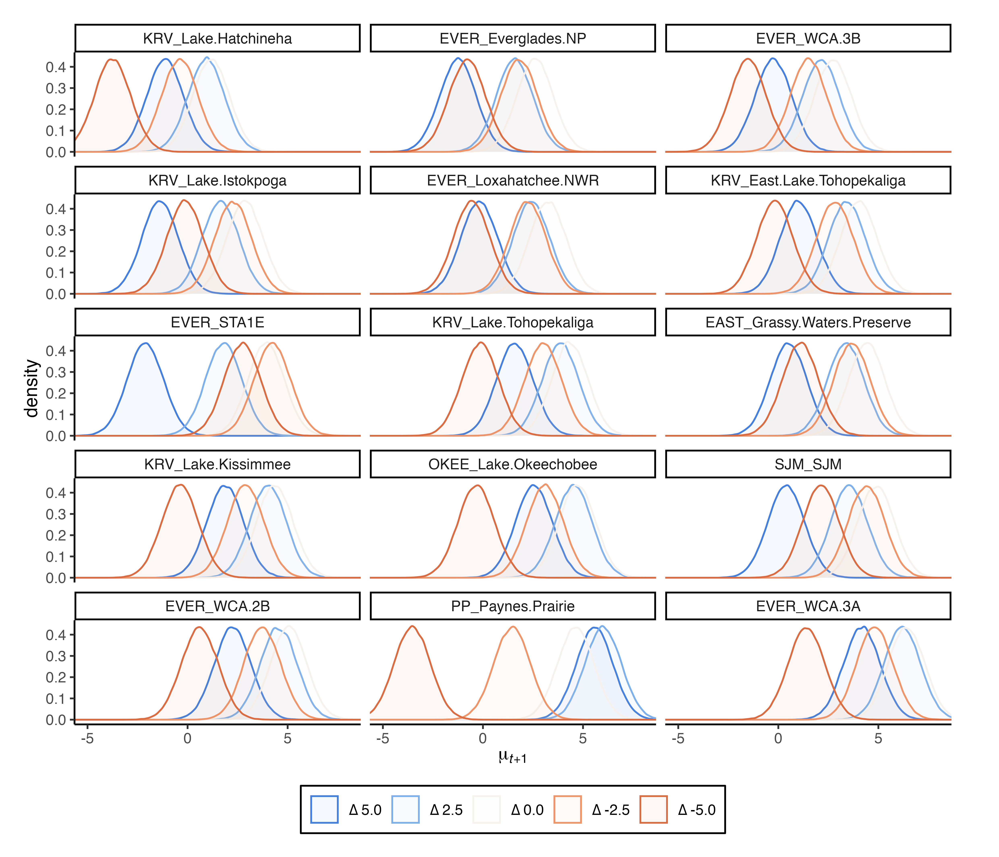

# Packages and functions
First, let's load the packages in `R` needed to run this code

```{r, message=FALSE}
# R functions and datasets to support "Modern Applied Statistics with S", 
  #a book from W.N. Venables and B.D. Ripley
library(MASS); 
# R functions for Data Cloning (maximum likelihood estimation using Bayesian MCMC)
library(dclone); 
# Create plots for MCMC output
library(mcmcplots)
# Data manipulation and elegant figures
library(tidyverse)
# Palettes inspired by works at the Metropolitan Museum of Art in New York
library(MetBrewer)
```


## Functions for initial guesses of parameters and random MVN generator

We will need initial or "naive" guesses of the parameters to fit the state-space model. This could be roughly computing by providing the vector of (log)abundance observations `Yobs` ($\mathbf{N}$) and the vector of observation times `Tvec` with the function `guess.calc()`:

```{r guess.calc}
guess.calc <- function(Yobs,Tvec){
  
  #  For calculations, time starts at zero.
  T.t <-Tvec-Tvec[1];
  #  Number of time series transitions, q.
  q <- length(Yobs)-1;
  #  q+1 gives the length of the time series.
  qp1 <- q+1;
  #  Time intervals
  S.t <- T.t[2:qp1]-T.t[1:q]; 
  #  Mean of the observations
  Ybar <- mean(Yobs);        
  # Variance of the observations
  Yvar <- sum((Yobs-Ybar)*(Yobs-Ybar))/q;
  # Initial mu estimate (at stationary distribution)
  mu1 <- Ybar;
  
  # Kludge an initial value for theta based on mean of Y(t+s) given Y(t).
  th1 <- -mean(log(abs((Yobs[2:qp1]-mu1)/(Yobs[1:q]-mu1)))/S.t);            
  # Moment estimate using stationary
  bsq1 <- 2*th1*Yvar/(1+2*th1);         
  # Observation error variance, assumed as first guess as betasq=tausq.
  tsq1 <- bsq1;                         
  
  # What to do if initial guesses is three 0's (or NAs)? Assume arbitrary values
  three0s <- sum(c(th1,bsq1,tsq1))
  if(three0s==0|is.na(three0s)){
    th1 <- 0.5;
    bsq1 <- 0.09; 
    tsq1 <- 0.23;
    }
  
  out1 <- c(th1,bsq1,tsq1);
  
  # What to do if initial guesses are too little? Assume arbitrary values
  if(sum(out1<1e-7)>=1){
    out1 <- c(0.5,0.09,0.23)
  }
  
  out <- c(mu1,out1);
  return(abs(out))
}
```

To take into account possible NAs in the counts, we can wrap these initial guess estimator function `guess.calc()` into another function `guess.calc2.0()`:

```{r guess.calc2.0}
guess.calc2.0<- function(TimeAndNs){
  
  newmat <- TimeAndNs 
  isnas <- sum(is.na(TimeAndNs))
  
  if(isnas >= 1){
    
    isnaind <- which(is.na(TimeAndNs[,2]), arr.ind=TRUE)
    newmat <- TimeAndNs[-isnaind,]
    newmat[,1] <- newmat[,1] - newmat[1,1]
    
  }
  
  init.guess <- guess.calc(Yobs = log(newmat[,2]), Tvec=newmat[,1])
  
  mu1  <- init.guess[1]
  th1  <- init.guess[2]
  bsq1 <- init.guess[3]
  sigsq1<- ((1-exp(-2*th1))*bsq1)/(2*th1)
  
  out <- c(mu=mu1, theta=th1, sigmasq = sigsq1)
  return(out)
}
```

We also need a Multivariate Normal random generator function `randmvn()`, which needs:

  1.  The number of random samples of a MVN vector: `n`
  2.  The mean vector of the MVN distribution to sample from: `mu.vec`
  3.  The variance-covariance matrix of the MVN distribution to sample from: `cov.mat`

```{r randmvn}
randmvn <- function(n, mu.vec, cov.mat){

  # Save the length of the mean vector of the multivariate normal distribution to sample
  p         <- length(mu.vec);
  # The Cholesky decomposition
    #(factorization of a real symmetric positive-definite sqr matrix)
  Tau       <- chol(cov.mat, pivot=TRUE);
  # generate normal deviates outside loop
  Zmat      <- matrix(rnorm(n=p*n,mean=0,sd=1),nrow=p,ncol=n);

  # empty matrix
  out       <- matrix(0,nrow=p,ncol=n);
  # iterate
  for(i in 1:n){
    Z       <- Zmat[,i];
    out[,i] <- t(Tau)%*%Z + mu.vec
  }

  return(out)
}
```


# Water effect on population dynamic and Pr. Falling Under Conservation Threshold

## Water data

We have four datasets: \\
1) `wetlands and demes.csv` \\
2) `survey_dates_1997_2025.csv` \\
3) `daily stage in each wetland.csv` \\
4) `snailkite counts by wetland 1997_2025.csv` \\

### Relationship of wetland names and regions

The first serve as a relationship of the names of each wetland and the regions
```{r}
# relationship of wetlands and regions ####
wetland_region <- read.csv("Code/wetlands and demes.csv") |>
  # adjust name "regions"
  rename(region = deme) |>
  # unify names (spaces and dash as points)
  mutate(wetland = gsub("[- ]", ".", wetland)) |>
  # remove the name of "CATCHMENT" which is "Grassy.Waters.Preserve"
    # and "Fellsmere" which is "SJM"
  filter(!wetland %in% c("CATCHMENT","Fellsmere"))

# count of number of wetlands per region
table(wetland_region$region)
```

### Ranges of dates for surveys

The first file provide the range of dates for each survey. We can use this to extract the water level for the week before each survey started. The functions in lubridate allow to deal with dates.
```{r}
# surveys dates to link water level data ####
survey_date <- read.csv("Code/survey_dates_1997_2025.csv") |>
  mutate(start = ymd(start),
         end = ymd(end),
         start.w = floor_date(start-6,"week"),
         end.w = floor_date(start, "week"))
```

### Daily water level for each wetland

Then, we have the water level for each day in each wetland.
```{r}
daily_wetland_water <- read.csv("Code/daily stage in each wetland.csv") |> 
  mutate(date = dmy(Daily.Date)) |>
  pivot_longer(cols = !c("date", "Daily.Date"),
               names_to = "wetland",
               values_to = "daily_water") |>
  mutate(wetland = ifelse(wetland == "Fellsmere", "SJM", wetland))

nrow(daily_wetland_water)
```

We can add the region. Some wetlands were not included, but we can assign them easily
```{r}
daily_wetland_water |>
  left_join(wetland_region) |>
  filter(is.na(region)) |>
  group_by(wetland) |>
  count()

daily_wetland_water <- daily_wetland_water |> 
  left_join(wetland_region) |>
  mutate(region = ifelse(wetland == "Kissimmee.Restoration.Area.N", "KRV",
                  ifelse(wetland == "Kissimmee.Restoration.Area.S", "KRV",
                  ifelse(wetland == "STA1W", "EVER",
                  ifelse(wetland == "Three.Forks.Marsh", "SJM",
                  region)))),
         region.wetland = paste0(region, "_", wetland)) |>
  group_by(region.wetland) |>
  mutate(mean_stage = mean(daily_water, na.rm = TRUE)) |>
  ungroup() |>
  mutate(center_water = daily_water - mean_stage) |>
  as.data.frame()
  
table(daily_wetland_water$region)
table(daily_wetland_water$region.wetland)
summary(daily_wetland_water)
```

We can filter the dates for the week before each survey

```{r}
# Filter water level at the weekly scale for the dates of surveys
www_filt <- pmap(survey_date, function(start.w, end.w, ...) {
  daily_wetland_water |>
    filter(date >= start.w & date <= end.w)
})

www_filt_df <- bind_rows(www_filt, .id = "survey_id")
www_filt_df$X <- as.integer(www_filt_df$survey_id)
www_filt_df <- www_filt_df |> 
  arrange(wetland, date)
head(www_filt_df)
```

There are NAs in the `daily_water` value for the different wetlands. We can assume that the data missing is at random and conduct an imputation using JAGS ([Kery & Royle, 2016](https://www-mbr--pwrc-usgs-gov.translate.goog/pubanalysis/keryroylebook/?_x_tr_sl=en&_x_tr_tl=es&_x_tr_hl=es&_x_tr_pto=tc)). In other words, we can model the relative water level as latent variable, using as predictors the region, wetland, and date. We can include an autoregressive effect (AR1), because each day's relative water level depends on the previous day's value when the previous observation belongs to the same wetland.

$$
\text{W}_{d} \sim \text{Normal}(\mu_{d},\sigma^{2}) \\
\mu_{d} = \beta_{1} * \text{Date}_{d} + \beta_{2}[\text{Region}_d] + \beta_{3}[\text{Wetland}_{d}] + \phi\times(W_{d-1}-\mu_{d-1})
$$
This model adds random intercepts for regions $\beta_{2}[Region_d]\sim\text{Normal}(0,\tau_{\text{region}}^{-1})$, and wetland-specific deviation centered on their region's effect $\beta_{3}[ Wetland_{d}]\sim\text{Normal}(\beta_2[\text{region}(w)],\tau_{wetland}^{-1})$, where $\text{region}(w)$ maps each wetland $w$ to its parent region. Finally, the AR1 effect $\phi \sim \text{Uniform}(-1,1)$ is added if the previous observation belongs to the same wetland as the current observation. This represents the deviation of the previous observation $W_{d-1}$ from its expected mean $\mu_{d-1}$ to correct the prediction of the current expected value $\mu_{d}$ (error correction model). 

```{r}
Impute.model.w <- function(){
  # Likelihood
  for (d in 2:D) {
    is_same_wetland[d] <- equals(wetland[d], wetland[d - 1])
    mu_w_prev[d] <- beta1_w * date[d-1] + beta2_w[region[d-1]] + beta3_w[wetland[d-1]]
    mu_w[d] <- beta1_w * date[d] + beta2_w[region[d]] + beta3_w[wetland[d]] +
               phi * is_same_wetland[d] * (water[d-1] - mu_w_prev[d])

    water[d] ~ dnorm(mu_w[d], tau_w)
  }

  # Prior for first observation
  water[1] ~ dnorm(mu_w[1], tau_w)
  mu_w[1] <- beta1_w * date[1] + beta2_w[region[1]] + beta3_w[wetland[1]]

  # Priors
  tau_w ~ dgamma(0.01, 0.01)
  beta1_w ~ dnorm(0, 0.01)
  phi ~ dunif(-1, 1)

  for (r in 1:n_regions) {
    beta2_w[r] ~ dnorm(0, tau_region_w)
  }
  tau_region_w ~ dgamma(0.01, 0.01)

  for (w in 1:n_wetlands) {
    beta3_w[w] ~ dnorm(beta2_w[region_for_wetland[w]], tau_wetland_w)
  }
  tau_wetland_w ~ dgamma(0.01, 0.01)
}
```

We need to adjust the data for this model.

```{r}
data_jags_w <- www_filt_df |> 
  dplyr::select(date, region, wetland, center_water) |> 
  mutate(
    # generate numeric index for categorical variables
    region = as.numeric(as.factor(region)),
    wetland = as.numeric(as.factor(wetland))
    )

n_wetlands = length(unique(data_jags_w$wetland))

region_for_wetland <- rep(NA, n_wetlands)
for (w in 1:n_wetlands) {
  region_for_wetland[w] <- unique(data_jags_w$region[data_jags_w$wetland == w])
}

dat_w <- list(
 D = nrow(data_jags_w),
 water = ifelse(is.na(data_jags_w$center_water), NA, data_jags_w$center_water),
 date = as.numeric(data_jags_w$date),
 region = data_jags_w$region,
 wetland = data_jags_w$wetland,
 n_regions = length(unique(data_jags_w$region)),
 n_wetlands = length(unique(data_jags_w$wetland)),
 region_for_wetland = region_for_wetland
)
```

Fit the model

```{r Fit imputation for water, eval=FALSE}
Impute.w.fit <- jags.fit(data = dat_w,
                       params = c("water","phi"),
                       model = Impute.model.w)
saveRDS(Impute.w.fit, "Code/Impute_Relative_Water_fit_AR1_noBeta0.rds")
```

Extract posterior means and add to original data to see the missing values

```{r Extract imputed water, eval=FALSE}
# Convert to matrix
mcmc_mat <- as.matrix(Impute.w.fit)

# Extract posterior means
water_means <- colMeans(mcmc_mat[, grep("^water\\[", colnames(mcmc_mat))])

# Add new columns with imputed values
www_filt_df$water_imputed <- www_filt_df$center_water
www_filt_df$water_imputed[is.na(www_filt_df$center_water)] <- water_means[is.na(www_filt_df$center_water)]

saveRDS(www_filt_df, "data/www_center_filtered_df_impute_AR1_noBeta0.RDS")
```

And we can explore how this imputation performed.
```{r}
www_filt_df <- readRDS("data/www_center_filtered_df_impute_AR1_noBeta0.RDS") |>
  filter(wetland != "Fellsmere")

www_filt_df_pre <- www_filt_df |>
  mutate(wet.reg = paste0(region, "_", wetland)) |>
  ggplot(aes(x = date, y = center_water, color = region)) +
  geom_hline(yintercept = 0, linetype = "dashed", color = "gray")+
  facet_wrap(~wetland, scales = "free_y", ncol = 4) +
  geom_point(alpha = 0.5)+
  scale_color_manual(values=met.brewer("Homer2",n = 6)) +
  scale_fill_manual(values=met.brewer("Homer2"),n = 6) +
  labs(title = "Data not imputed",
       y = "Relative water (stage)")+
  theme_classic()+
  theme(legend.position = "bottom")+
  guides(color = guide_legend(nrow = 1),
         fill = guide_legend(nrow = 1))

ggsave(filename = "ww_pre_impute.jpg", www_filt_df_pre, dpi = 300,
       width = 230, height = 200, units = "mm")

www_filt_df_post <- www_filt_df |>
  mutate(wet.reg = paste0(region, "_", wetland)) |>
  ggplot(aes(x = date, y = center_water, color = region)) +
  geom_hline(yintercept = 0, linetype = "dashed", color = "gray")+
  facet_wrap(~wetland, scales = "free_y", ncol = 4) +
  geom_line(aes(y = water_imputed))+
  geom_point(alpha = 0.05)+
  labs(title = "Data imputed (line)",
       y = "Relative water (stage)")+
  scale_color_manual(values=met.brewer("Homer2",n = 6)) +
  scale_fill_manual(values=met.brewer("Homer2"),n = 6) +
  theme_classic()+
  theme(legend.position = "bottom")+
  guides(color = guide_legend(nrow = 1),
         fill = guide_legend(nrow = 1))

ggsave(filename = "ww_post_impute.jpg", www_filt_df_post, dpi = 300,
       width = 230, height = 200, units = "mm")

```


### Counts per wetlands across 6 surveys per year

This dataset include the counts per survey
```{r}
# Counts per wetland in 6 regions ####
snki_N_wetland <- read.csv("Code/snailkite counts by wetland 1997_2025.csv")
names(snki_N_wetland)
```

Converting in a long format matches the organization of the water level, which we can add and then extract the mean and standard deviation value for each week before each survey (immediate conditions pre-survey might affect the counts).
```{r, warning=FALSE}
# long format with water level per survey
snki_N_wetland_region <- snki_N_wetland |>
  # move wetland columns to a single, having the count reported
  pivot_longer(cols = !c(X, year, survey_num), 
               names_to = "wetland", 
               values_to = "count") |>
  mutate(wetland = ifelse(wetland == "CATCHMENT", "Grassy.Waters.Preserve",
                          wetland),
         wetland = ifelse(wetland == "Fellsmere", "SJM",
                          wetland), 
         wetland = ifelse(wetland == "Arbuckle", "Lake.Arbuckle",
                          wetland)) |> 
  # merge with the daily water wetland level
  left_join(www_filt_df |> 
              select(X, wetland, water_imputed)) |>
  filter(!is.na(water_imputed) | !is.na(count)) |>
  # merge the region 
  left_join(wetland_region) |>
  rename(survey_id = X) |>
  # extract survey mean and CV
  group_by(region, wetland, year, survey_id, survey_num) |>
  summarise(
    count = round(mean(count, na.rm = TRUE),0),
    mu_water = mean(water_imputed, na.rm = TRUE),
    sd_water = sd(water_imputed, na.rm = TRUE)) |>
  arrange(region, wetland, year) |>
  as.data.frame() 
  
```

We can explore which wetlands has more data
```{r}
snki_N_wetland_region |> 
  mutate(region = ifelse(wetland == "STA.Lakeside.Ranch","OTHER",
                         region)) |> 
  # to summarize, `group_by()`
  group_by(region, wetland) |>
  # remove NA surveys
  drop_na(count) |> 
  # how many surveys per wetland?
  count() |> 
  # sort the information (for Table 1 in the report)
  arrange(region, -n) |> 
  filter(region != "OTHER") |>
  as.data.frame()
```

And we select to work with those wetlands with surveys ≥75% of the data in relation with the maximum per region. For example, OKEE include two wetlands, the maximum number of surveys is for Lake Okeechobee (148), the 75% is 111; thus, the second wetland (Lake Hicpochee Impoundments) with only 15 surveys does not have enough surveys. 

```{r}
snki_N_water <- snki_N_wetland_region |> 
  # here we can select the wetlands with more data to represent each region
  filter(wetland %in% c(
    "Grassy.Waters.Preserve", # EAST
    "WCA.3A", # EVER
    "WCA.2B", # EVER
    "Loxahatchee.NWR", # EVER
#    "WCA.2A", # EVER - but does not have hydrology gauge data
    "WCA.3B", # EVER
    "Everglades.NP", # EVER
    "STA1E", # EVER
    "East.Lake.Tohopekaliga", # KRV
    "Lake.Kissimmee", # KRV
    "Lake.Istokpoga", # KRV
    "Lake.Hatchineha", # KRV - below threshold of surveys, but added for managers interest
    "Lake.Tohopekaliga", # KRV - below threshold of surveys, but added for managers interest
    "Lake.Okeechobee", # OKEE
    "Paynes.Prairie", # PP
    "SJM" # SJM
    )) |>
  # unify in a single name
  mutate(region.wetland = paste(region, wetland, sep = "_")) |>
  filter(year != 2025) |>
  arrange(region.wetland,year) |>
  as.data.frame()
```

### Matrix form of the counts and mean water level the week before starting the survey

Data frame for the counts

```{r}
snki_counts <- snki_N_water |> 
  dplyr::select(year, survey_num, region.wetland, count) |>
  pivot_wider(names_from = region.wetland, values_from = count) |>
  as.data.frame()
```

Data frame for the water level mean (of the week before starting the survey)

```{r}
snki_water <- snki_N_water |> 
  dplyr::select(year, survey_num, region.wetland, mu_water) |>
  pivot_wider(names_from = region.wetland, values_from = mu_water) |>
  as.data.frame()
```

Data frame for the water level standard deviation (of the week before starting the survey)

```{r}
snki_water_SD <- snki_N_water |> 
  dplyr::select(year, survey_num, region.wetland, sd_water) |>
  pivot_wider(names_from = region.wetland, values_from = sd_water) |>
  as.data.frame()
```

And generate the three matrices

```{r}
names.snkicounts <- names(snki_counts)
wet.names <- c(
  "EAST_Grassy.Waters.Preserve", # EAST
    "EVER_WCA.3A", # EVER
    "EVER_WCA.2B", # EVER
    "EVER_Loxahatchee.NWR", # EVER
#    "WCA.2A", # EVER - but does not have hydrology gauge data
    "EVER_WCA.3B", # EVER
    "EVER_Everglades.NP", # EVER
    "EVER_STA1E", # EVER
    "KRV_East.Lake.Tohopekaliga", # KRV
    "KRV_Lake.Kissimmee", # KRV
    "KRV_Lake.Istokpoga", # KRV
    "KRV_Lake.Hatchineha", # KRV - below threshold of surveys, but added for managers interest
    "KRV_Lake.Tohopekaliga", # KRV - below threshold of surveys, but added for managers interest
    "OKEE_Lake.Okeechobee", # OKEE
    "PP_Paynes.Prairie", # PP
    "SJM_SJM" # SJM
  )
cols.with.counts <- match(wet.names, names.snkicounts)
years <- unique(snki_counts$year)
nyears <- length(years)
year.col <- which(names.snkicounts=="year",arr.in=TRUE)
surv.num <- unique(snki_counts$survey_num)
tt <- years - years[1]

S4mat <- S5mat <- S6mat <- matrix(0, nrow=length(wet.names), ncol=nyears)

Counts.list <- list(S4mat = S4mat, S5mat=S5mat, S6mat=S6mat)
Water.list <- list(W4mat =  S4mat, W5mat=S5mat, W6mat=S6mat)
WaterSD.list <- list(W4matSD =  S4mat, W5matSD=S5mat, W6matSD=S6mat)

for(i in 1:3){
  SN <- surv.num[(i+3)]
  ith.rows   <- which(snki_counts$survey_num==SN, arr.ind=TRUE)
  
  ith.datmat <- t(snki_counts[ith.rows, cols.with.counts])
  ith.watmat <- t(snki_water[ith.rows, cols.with.counts])
  ith.watSDmat <- t(snki_water_SD[ith.rows, cols.with.counts])
  colnames(ith.datmat) <- colnames(ith.watmat) <- colnames(ith.watSDmat) <- tt
  
  Counts.list[[i]] <- ith.datmat
  Water.list[[i]] <- ith.watmat
  WaterSD.list[[i]] <- ith.watSDmat
}
```

## Model

The model in full matrix format including water is:
$$
\mathbf{X}_{t+1} = \mathbf{A} + \beta\mathbf{W}^2_t+ (\mathbf{I} + \mathbf{B})\mathbf{X}_t + \mathbf{E}_t
$$

and the State-space model is completed by including the observation process, as a Poisson error with detection probability:

$$
\mathbf{N}_{t} \sim \text{Poisson}(\mathbf{p}_{t} \times e^{\mathbf{X}_{t}})
$$

```{r DC model including water and detection}
MGSS_DC_w4.0 <- function(){
  ##### Priors (no cloning)
  lmuvec    ~ dmnorm(mupmean, muprec)
  lthetavec ~ dmnorm(lthetamean, lthetaprec)
  lsigmasq ~ dnorm(0, 1)
  betaw ~ dnorm(0,1)
  #mig ~ dbeta(2,2)
  mig.near ~ dnorm(0,1)
  mig.far ~ dnorm(0,1)
  
  sigmasq <- exp(lsigmasq)  
  for(pp in 1:p){
    muvec[pp] <- exp(lmuvec[pp])
    thetavec[pp] <- exp(lthetavec[pp])
    cvec[pp] <- exp(-thetavec[pp])
  }
  
  Sigma <- (1/sigmasq)*Ip
  
  for(m in 1:p){
    for(n in 1:p){
      B[m,n] <- ifelse((m==n),cvec[m],ifelse(
        (m==step.stone[m,1])&&(n==step.stone[m,2]), 
        dinvmat[m,n]*mig.near,dinvmat[m,n]*mig.far)
      )
    }
  }
  
  A[1:p]  <- (Ip - B[1:p,1:p])%*%muvec
  
  for(k in 1:K){
    ##### ---- Likelihood (data cloning) ---- #####
    X[1:p,1,k] ~ dmnorm(muvec + betaw*W[1:p,1], Sigma) #muvec + beta*water[,1]
    for(h in 1:p){
      N4[h,1,k] ~ dpois(detectp[h,1]*exp(X[h,1,k]))
      N5[h,1,k] ~ dpois(detectp[h,1]*exp(X[h,1,k]))      
      N6[h,1,k] ~ dpois(detectp[h,1]*exp(X[h,1,k]))
    }
    for( i in 2:qp1){ 
      ## Process error
      X[1:p,i,k]  ~ dmnorm(A[1:p] + betaw*W[1:p,i] + B[1:p,1:p]%*%X[1:p,(i-1),k], Sigma);
      for(j in 1:p){
        N4[j,i,k]  ~ dpois(detectp[j,i]*exp(X[j,i,k])) ## Observation error
        N5[j,i,k]  ~ dpois(detectp[j,i]*exp(X[j,i,k])) ## Observation error        
        N6[j,i,k]  ~ dpois(detectp[j,i]*exp(X[j,i,k])) ## Observation error        
      }
    }
  }  
}
```

Bring back the counts and water level of the 11 wetlands representing 6 regions.  

```{r counts for 11 wetlands}
S4mat <- Counts.list$S4mat[1:15,1:28] # Cut the last time step: no data anywhere
S5mat <- Counts.list$S5mat[1:15,1:28]
S6mat <- Counts.list$S6mat[1:15,1:28]

S4mat[is.na(S4mat)] <- NA
S5mat[is.na(S5mat)] <- NA
S6mat[is.na(S6mat)] <- NA
```

But for now, lets combine a single value of mean water level across the three surveys (first approach)
```{r water mean per survey for 11 wetlands}
W4mat <- Water.list$W4mat[1:15,1:28] # Cut the last time step: no data anywhere
W5mat <- Water.list$W5mat[1:15,1:28]
W6mat <- Water.list$W6mat[1:15,1:28]
W <- (W4mat + W5mat + W6mat) / 3
W[is.na(W)] <- NA
```

Again, we pick a single time series of counts with no `NA`s, and "`cbind()` it" to a column of time, thus getting a matrix with time as a first column and counts as a second column. We use this matrix to compute a first guess of the model parameters to be used in all regions.

```{r}
ts.4guess  <- S4mat[8,]+1 # some 0s and NAs bring the first guess to Inf, thus add 1 only for this first guess
tvec4guess  <- as.numeric(colnames(S4mat))
onets4guess <- cbind(tvec4guess, ts.4guess)
naive.guess <- guess.calc2.0(TimeAndNs = onets4guess)
naive.guess
```

We can bring the distance between regions, using the centroid and distance from the edge of a convex polygon of the historical geolocation of nests in each region. The data was provided in meters, but it could be convenient numerically to convert it to kilometers. In addition, we assign the row names that matches with our survey matrices.

```{r}
# mean distance from the centroid 
wet.dists <- read.csv("Code/Wetlands_centroid distance in meters.csv")[,-c(1:3)]
wet.dists <- as.matrix(wet.dists)/1000
rownames(wet.dists) <- rownames(S4mat)
wet.dists
```

And the annual detection probability estimated from the CMR model
```{r}
all.ps <- read.csv(file="Code/p.estimates.wt.7.24.25.csv")
names(all.ps)

# I am going to leave it as a matrix of ps in case we want to make them 
# time dependent later
phats <- matrix(nrow=15, ncol=28)
row.names(phats) <- wet.names
for(i in 1:15){
  subdat <- all.ps[all.ps$stratum==sub("_.*", "", wet.names)[i],]
  phats[i,] <- subdat$estimate
}
```

The number of (sub)populations `p` now is defined as the 15 wetlands, and included in the initial values lists. This is a trick to have the priors in the positive domain of the lognormal distribution.
```{r}
p <- nrow(S4mat)
myinits <- list(lmuvec = log(rep(naive.guess[1],p)), # mu ≈ mean(log(ts.4guess)),
                lthetavec = log(rep(naive.guess[2],p)), # why theta in log?
                lsigmasq = log(naive.guess[3])) # why sigmasq in log?
```

We next define the "dinvmat" choosing one of the distance matrices. This is the inverse matrix of distances, because in our model, the effect of one region on the growth rate of another region will be made inversely proportional to their mutual geographical distance.
```{r}
dmat <- wet.dists 
dinvmat <- (dmat/dmat^2)  
dinvmat[is.na(dinvmat)] <- 0
dinvmat
```

Bundle the data cloning fit
```{r Data for dclone water}
data4dclone <- list(K=1, 
                    N4=dcdim(array(S4mat,dim=c(p,ncol(S4mat),1))), 
                    N5=dcdim(array(S5mat,dim=c(p,ncol(S5mat),1))), 
                    N6=dcdim(array(S6mat,dim=c(p,ncol(S6mat),1))), 
                    W = W^2, # testing quadratic
                    detectp = phats,
                    qp1=ncol(S4mat), 
                    p=p, 
                    mupmean=rep(6,p), 
                    muprec=(1/3)*diag(p),
                    lthetamean = rep(0.5,p), 
                    lthetaprec =  10*diag(p),
                    Ip =  diag(p),
                    dinvmat = dinvmat,
                    step.stone = matrix(c(1,7,
                                          2,5, 3,2, 4,7, 5,2, 6,5, 7,4, 
                                          8,12, 9,11, 10,9, 11,9, 12,8,
                                          13,7,
                                          14,8,
                                          15,9),
                                        nrow=15,ncol=2,byrow=TRUE)
)
```

Setup the data cloning model fit with wather and annual detection probability
```{r setup datacloning model fit with water, eval=FALSE}
cl.seq <- c(1,20);
n.iter<-100000;n.adapt<-50000;n.update<-100;thin<-10;n.chains<-3;

out.parms <- c("muvec","cvec","mig.near","mig.far","sigmasq","A",
               "betaw")
mgssdclone_w <- dc.fit(data4dclone, 
                     params=out.parms, 
                     model=MGSS_DC_w4.0, 
                     n.clones=cl.seq,
                     multiply="K", 
                     unchanged = c("qp1","p","mupmean","muprec", 
                      "step.stone", "lthetamean","lthetaprec", "Ip","dinvmat", 
                      "W","detectp"),
                     n.chains = n.chains, 
                     n.adapt=n.adapt, 
                     n.update=n.update,
                     n.iter = n.iter, 
                     thin=thin, 
                     inits=myinits) 
saveRDS(mgssdclone_w, "Code/mgssdclone_w_phat_quadr.RDS")
```

We can save the MLEs and predict the dynamic of the population for each wetland within six regions with the Kalman filter estimates

```{r}
mgssdclone_w <- readRDS("Code/mgssdclone_w_phat_quadr.RDS")
mlescentrdist <- summary(mgssdclone_w)[[1]]
mles4kalman <- mlescentrdist[,1]
mles4kalman
avec4kalman <- mles4kalman[1:15]
beta.4kalman <- mles4kalman[16]
cvec4kalman <- mles4kalman[17:31]
mig.far4kalman <- mles4kalman[32]
mig.near4kalman <- mles4kalman[33]
muvec4kalman <- mles4kalman[34:48]
sigsq4kalman <- mles4kalman[49]
```

## Kalman estimates of abundance with effect of assymetric migration

```{r}
MGSS_KALMANw4.0 <- function(){
  
  A  <- (Ip - B)%*%muvec
  Sigma <- (1/sigmasq)*Ip
  
  ##### ---- Likelihood ---- #####
  X[1:p,1] ~ dmnorm(muvec + betaw*W[1:p,1], Sigma)
  for(h in 1:p){
    N4[h,1] ~ dpois(detectp[h,1] * exp(X[h,1]))
    N5[h,1] ~ dpois(detectp[h,1] * exp(X[h,1]))    
    N6[h,1] ~ dpois(detectp[h,1] * exp(X[h,1]))    
  }
  for( i in 2:qp1){ 
    ## Process error
    X[1:p,i]  ~ dmnorm(A + betaw*W[1:p,i] + B%*%X[1:p,(i-1)], Sigma); 
    for(j in 1:p){
      N4[j,i]  ~ dpois(detectp[j,i] * exp(X[j,i])) ## Observation error
      N5[j,i]  ~ dpois(detectp[j,i] * exp(X[j,i])) ## Observation error      
      N6[j,i]  ~ dpois(detectp[j,i] * exp(X[j,i])) ## Observation error
    }
  }
}
```

Data for Kalman estimates

```{r}
step.stone <- matrix(c(1,7,
                       2,5, 3,2, 4,7, 5,2, 6,5, 7,4, 
                       8,12, 9,11, 10,9, 11,9, 12,8,
                       13,7,
                       14,8,
                       15,9),
                     nrow=15,
                     ncol=2,
                     byrow=TRUE)
step.stone

B <- matrix(0,p,p)

for(m in 1:p){
  for(n in 1:p){
    B[m,n] <- ifelse((m==n),cvec4kalman[m],
                     ifelse(
      (m==step.stone[m,1])&&(n==step.stone[m,2]), 
      dinvmat[m,n]*mig.near4kalman,dinvmat[m,n]*mig.far4kalman)
    ) #
    
  }
}

print(B) # this is \mathcal{B}, because the diagonal is the `cvec4kalman` (intra-region strength of density dependence)

data4kalman <- list(N4=S4mat,
                    N5=S5mat,
                    N6=S6mat,
                    W = W^2,
                    qp1=ncol(S4mat), 
                    p=p,
                    detectp = phats,
                    Ip =  diag(p),
                    betaw = beta.4kalman,
                    muvec = muvec4kalman,
                    sigmasq = sigsq4kalman, 
                    B=B
)
str(data4kalman)
```

And fit the Kalman estimate model
```{r set up and fit Kalman estimate model, eval=FALSE}
n.iter<-100000
n.adapt<-1000
n.update<-100
thin<-10
n.chains<-3

out.parms <- c("X")
kalman.mcmc.w <- jags.fit(data4kalman, 
                         params=out.parms, 
                         model=MGSS_KALMANw4.0, 
                         n.chains = n.chains, 
                         n.adapt=n.adapt, 
                         n.update=n.update, 
                         n.iter = n.iter, 
                         thin=thin)
saveRDS(kalman.mcmc.w, "Code/Kalman_w_quad_phat_OUSS.RDS")
```

And then, bring back the data to see the population trajectories in each region.

```{r}
kalman.mcmc.w <- readRDS("Code/Kalman_w_quad_phat_OUSS.RDS")
Xkalman.w <-  do.call(rbind, kalman.mcmc.w)

Kalman.quants.w <- apply(Xkalman.w, 2, FUN=function(x){quantile(x, probs=c(0.025,0.5,0.975))}) 

```

Converting the matrix form to a data frame and extracting the values

```{r dataframe adjustment}
kalman_df_w <- as.data.frame(Kalman.quants.w) |>
  mutate(quantile = rownames(Kalman.quants.w)) |>
  pivot_longer(-quantile, 
               names_to = "state_time", 
               values_to = "value") |>
  extract(state_time, 
          into = c("wetland", "time"), 
          regex = "X\\[(\\d+),(\\d+)\\]", convert = TRUE)
```

And then plotting with the names of the regions and in real scale of counts, adding the three surveys per year

```{r Figure at real scale with obs counts, warning=FALSE}
kalman_wide_w <- kalman_df_w |>
  mutate(value = exp(value),
         wetland = ifelse(wetland == 1, "EAST_Grassy.Waters.Preserve",
                  ifelse(wetland == 2, "EVER_WCA.3A",
                  ifelse(wetland == 3, "EVER_WCA.2B",
                  ifelse(wetland == 4, "EVER_Loxahatchee.NWR",
                  ifelse(wetland == 5, "EVER_WCA.3B",
                  ifelse(wetland == 6, "EVER_Everglades.NP",
                  ifelse(wetland == 7, "EVER_STA1E",
                  ifelse(wetland == 8, "KRV_East.Lake.Tohopekaliga",
                  ifelse(wetland == 9, "KRV_Lake.Kissimmee",
                  ifelse(wetland == 10, "KRV_Lake.Istokpoga",
                  ifelse(wetland == 11, "KRV_Lake.Hatchineha",
                  ifelse(wetland == 12, "KRV_Lake.Tohopekaliga",
                  ifelse(wetland == 13, "OKEE_Lake.Okeechobee",
                  ifelse(wetland == 14, "PP_Paynes.Prairie",
                  ifelse(wetland == 15, "SJM_SJM",
                  wetland)))))))))))))))) |>
  pivot_wider(names_from = quantile, 
              values_from = value)

#counts
S4df <- as.data.frame(S4mat) |>
  mutate(wetland = rownames(S4mat)) |>
  pivot_longer(-wetland, 
               names_to = "time", 
               values_to = "Count4") 
S5df <- as.data.frame(S5mat) |>
  mutate(wetland = rownames(S5mat)) |>
  pivot_longer(-wetland, 
               names_to = "time", 
               values_to = "Count5") 
S6df <- as.data.frame(S6mat) |>
  mutate(wetland = rownames(S6mat)) |>
  pivot_longer(-wetland, 
               names_to = "time", 
               values_to = "Count6") 

Countsdf <- S4df |>
  left_join(S5df) |>
  left_join(S6df) |>
  mutate(time = as.numeric(time) + 1)

kalman_wide <- kalman_wide_w |> 
  left_join(Countsdf) |>
  mutate(time = time + 1996,
         region = str_extract(wetland, "[^_]+"))

kalman_wide$wetland <- factor(kalman_wide$wetland,
                             levels = c("EAST_Grassy.Waters.Preserve", # EAST
                                        "EVER_WCA.3A", # EVER
                                        "EVER_WCA.2B", # EVER
                                        "EVER_Loxahatchee.NWR", # EVER
                                        "EVER_WCA.3B", # EVER
                                        "EVER_Everglades.NP", # EVER
                                        "EVER_STA1E", # EVER
                                        "KRV_East.Lake.Tohopekaliga", # KRV
                                        "KRV_Lake.Kissimmee", # KRV
                                        "KRV_Lake.Istokpoga", # KRV
                                        "KRV_Lake.Hatchineha", # KRV
                                        "KRV_Lake.Tohopekaliga", # KRV
                                        "OKEE_Lake.Okeechobee", # OKEE
                                        "PP_Paynes.Prairie", # PP
                                        "SJM_SJM" # SJM
                                        ))

# Plot using ggplot2
Wetland_water_detectp <- ggplot(kalman_wide, aes(x = time, y = `50%`, 
                        color = factor(region), 
                        fill = factor(region))) +
  facet_wrap(~factor(wetland, 
                     levels = c(
                       "EVER_Everglades.NP","EVER_WCA.3B","EVER_Loxahatchee.NWR",
                       "EVER_STA1E","EVER_WCA.2B","EVER_WCA.3A",
                       "OKEE_Lake.Okeechobee",
                       "KRV_Lake.Hatchineha","KRV_Lake.Istokpoga",
                       "KRV_East.Lake.Tohopekaliga",
                       "KRV_Lake.Tohopekaliga",
                       "KRV_Lake.Kissimmee",
                       "EAST_Grassy.Waters.Preserve",
                       "SJM_SJM",
                       "PP_Paynes.Prairie"
                       )), 
             ncol = 3, scales = "free_y") +
  geom_line() +
  geom_ribbon(aes(ymin = `2.5%`, ymax = `97.5%`), 
              alpha = 0.2, color = NA) +
  geom_point(aes(y = Count4), shape = 25, fill = NA)+
  geom_point(aes(y = Count5), shape = 21, fill = NA)+
  geom_point(aes(y = Count6), shape = 24, fill = NA)+
  labs(
    x = "Year",
    y = "Local resident abundance",
    color = "",
    fill = ""
    ) +
  scale_color_manual(values=met.brewer("Homer2", 6)) +
  scale_fill_manual(values=met.brewer("Homer2", 6)) +
  theme_classic() +
  theme(legend.position = "bottom",
        legend.direction = "horizontal",
        plot.margin = margin(0.5, 1, 0.5, 0.5, "cm")) +
  guides(color=guide_legend(nrow =1),
         fill=guide_legend(nrow = 1))

ggsave(Wetland_water_detectp, filename = "Wetland_15_water_phat.pdf",dpi = 300,
       width = 200, height = 150, units = "mm")
ggsave(Wetland_water_detectp, filename = "Wetland_15_water_phat.jpg",dpi = 300,
       width = 200, height = 150, units = "mm")
```
<br>

In this plot, the open points represent three surveys per year: down-facing triangles are survey 4, circles are survey 5, and up-facing triangles are survey 6. This dynamic includes the extra parameter for detectability and the influence of relative water sage as a quadratic effect. Using quadratic effect of water reduces the confidence intervals of predicted trajectories of the population.

<br>

# How does a change in water level affects the growth rate of the different populations?
Our modified Gompertz model in full matrix format that includes standardized quadratic water level effects is:

$$
\mathbf{X}_{t+1} = \mathbf{A} + \beta\mathbf{W}^2_t+ (\mathbf{I} + \mathbf{B})\mathbf{X}_t + \mathbf{E}_t
$$
\noindent where $\mathbf{W}$ denotes the standardized water level as explained in the main text.  The State-space model is completed by including the observation process, as a Poisson error with detection probability:

$$
\mathbf{N}_{t} \sim \text{Poisson}(p_{t} \times e^{\mathbf{X}_{t}}).
$$

The idea of including the effect of water levels in the growth rate is to be able to compare the estimated growth rate after accounting for the effect of water with the standard growth rate, a little bit like one would compare the reduction of the residual sum of squares brought about by an extra factor added to a regression model. From the initial model we have that

$$
\begin{array}{lll}
\mathbf{X}_{t+1} &=& \mathbf{X}_t + \mathbf{A} + \mathbf{BX}_t + \mathbf{E}_t\\
&=& \mathbf{A} + (\mathbf{I} + \mathbf{B})\mathbf{X}_t + \mathbf{E}_t\quad\text{where}\quad\mathcal{B} = \mathbf{I}+ \mathbf{B}.
\end{array}
$$
\noindent Hence, the growth rate $\text{R}_t$ is written as:
$$
\begin{array}{lll}
\text{R}_t&=& \mathbf{X}_{t+1} - \mathbf{X}_t \\
 &=& \mathbf{A} + \mathbf{BX}_t+\mathbf{E}_t \\ 
&=& \mathbf{A} + (\mathcal{B}-\mathbf{I})\mathbf{X}_t + \mathbf{E}_t.
\end{array}
$$

With a water covariate effect, the growth rate becomes:

$$
\text{R}_{t}^{W}= \mathbf{X}_{t+1} - \mathbf{X}_t = \mathbf{A} + \mathbf{BX}_t + \beta W_t^2 + \mathbf{E}_t.
$$

%%%%%%%%%%%% CONTINUE HERE

\noindent Thus, to achieve a benchmark comparison with the model without a water covariate, we can simply subtract both growth rates which simply yields $\beta W^2$.  Because that coefficient is assumed to be the same for all populations, scaling it by the vector of means $\boldsymbol{\mu} = \mathbf{(I-B)^{-1}A}$ allows one to compare visually how the water term affects the growth rate.  Thus, we set the estimate of the water effects as:

$$
\boldsymbol{\beta_W} = \frac{\widehat{\beta}W_t^{2}}{\widehat{\boldsymbol{\mu}}}.
$$


\noindent where we abuse a bit of the vector notation and remark that the division in the above fraction represents element-wise division.  Thus, $\boldsymbol{\beta_W}$ is a vector of estimated water effects per wetland studied. We emphasize that adopting this statistic to estimate the water effects is useful because it directly shows how the maximum growth rates, the strength of density dependence and the inter-demes effects $b_{ij}$ regulate the effect of water level changes in every deme.  Finally, note that using the value of $\boldsymbol{\mu}$ to scale the water effect is also justified because it is the value of the process that renders the growth rate zero on average. To see why, recall that in the long-run, $\mathbf{X}_t = \mathbf{X}_{t+1} = \mathbf{X}_{\infty}$ is invariant over time so that the average growth rate is $\text{E}[\text{R}_t] = \mathbf{0} = \text{E}[\mathbf{A} + (\mathcal{B}-\mathbf{I})\mathbf{X}_\infty + \mathbf{E}_t]$. To check that this is true, note that the right hand side (RHS) of this last equation is $\mathbf{A} + (\mathcal{B}-\mathbf{I})\text{E}[\mathbf{X}_\infty] = \mathbf{A} + (\mathcal{B}-\mathbf{I})\boldsymbol{\mu}$ and since $\boldsymbol{\mu} = (\mathbf{I-B})^{-1}\mathbf{A}$ the last equation becomes $\mathbf{A} -\mathbf{IA} = \mathbf{0}$.


```{r}
# standardize growth rate changes per population
# ((A + BX - ßW)-(A + BX)) / (A + BX)
# ßW/(A+BX) # fraction of reduction in growth rate

# average growth rate (A+(B-I)X)
avg.gr <- muvec4kalman #avec4kalman + (B-diag(p)) %*% muvec4kalman

# Get a range of Water level (centered) for plotting
W.sim = seq(min(W),max(W),by = 0.01)
W.sim.sqr = W.sim^2

std.gr.hat <- matrix(0, nrow = length(W.sim), ncol = 15)
for (i in 1:15){
  std.gr.hat[,i] <- (beta.4kalman * W.sim.sqr) / (avg.gr[i])
}

cool.palette <- as.vector(met.brewer("Signac",15))

wet.names

#std.gr.hat <- mat.forlist

colnames(std.gr.hat) <- wet.names

par(mfrow=c(2,3), oma=c(2,2,2,2), mar=c(4,4,4,2))
plot(W.sim, std.gr.hat[,1], col=cool.palette[1],
     type = "l", 
     xlab="", ylab="",
     xlim = c(min(W),max(W)),ylim=c(-2,0),
     bty="l", main="EAST", cex.main=1.25,lwd=2)
for(i in 2:7){
  if(i==2){
    plot(W.sim,std.gr.hat[,i], type="l", col=cool.palette[i],
     xlim = c(min(W),max(W)), ylim=c(-2,0),
     xlab="", ylab="",
     bty="l", main="EVER", cex.main=1.25,lwd=2)
   }
  else{
    points(W.sim,std.gr.hat[,i], type="l", col=cool.palette[i],lwd=2)
  }
}  
for(i in 8:12){
  if(i==8){
    plot(W.sim,std.gr.hat[,i], type="l", col=cool.palette[i],
     xlim = c(min(W),max(W)), ylim=c(-2,0),
     xlab="", ylab="",
     bty="l", main="KRV", cex.main=1.25,lwd=2)
   }
  else{
    points(W.sim,std.gr.hat[,i], type="l", col=cool.palette[i],lwd=2)
  }
}  
plot(W.sim, std.gr.hat[,13], col=cool.palette[13],lwd=2,
     type = "l", 
     xlim = c(min(W),max(W)),xlab="", ylab="",  ylim=c(-2,0),
     bty="l", main="OKEE", cex.main=1.25)
plot(W.sim, std.gr.hat[,14], col=cool.palette[14],lwd=2,
     type = "l", 
     xlim = c(min(W),max(W)),xlab="", ylab="",  ylim=c(-2,0),
     bty="l", main ="PP", cex.main=1.25)
plot(W.sim, std.gr.hat[,15], col=cool.palette[15],lwd=2,
     type = "l", 
     xlim = c(min(W),max(W)),xlab="", ylab="", ylim=c(-2,0),
     bty="l", main="SJM", cex.main=1.25)

mtext("Relative water (stage)", side=1, cex=1.25, outer=TRUE)
mtext("Std. ∆ in growth rate",side=2, cex=1.25, outer=TRUE)

```

Next, we show the code to compute the confidence intervals for the parabolic curves shown in the previous plot:

```{r cis for water effects, eval=FALSE}

# create a Function to compute the
# standardized growth rate changes per population
# ((A + BX - ßW)-(A + BX)) / (A + BX) 
# ßW/(A+BX) # fraction of reduction in growth rate

one.boot.quad.effect <- function(p, muvec4kalman, beta.4kalman){

  # average growth rate (A+(B-I)X)
  avg.gr <- muvec4kalman
  #avg.gr[avg.gr==0] <- .Machine$double.xmin
  #print(avg.gr)
  # Get a range of Water level (centered) for plotting
  W.sim = seq(min(W),max(W),by = 0.01)
  W.sim.sqr = W.sim^2

  std.gr.hat <- matrix(0, nrow = length(W.sim), ncol = 15)
  for (i in 1:15){
    std.gr.hat[,i] <- (beta.4kalman * W.sim.sqr) / (avg.gr[i])
  }
  
  return(std.gr.hat)
}

# Pull back the MCMC chain only with the parameters I need

# Print these three lines to recall the structure of the MCMC chain
length(mgssdclone_w)
dim(mgssdclone_w[[1]])
colnames(mgssdclone_w[[1]])


NMCMC <- dim(mgssdclone_w[[1]])[1]

st.gr.boot.list <- list() #Here I will save 10000 std.gr.hats

inftest <- rep(0, NMCMC)
for(i in 1:NMCMC){
  
  # Retrieve the model parameters:
  beta.star <- mgssdclone_w[[1]][i,16]
  muvec.star <-   mgssdclone_w[[1]][i,34:48]

  mat.forlist <- one.boot.quad.effect(p=p, 
                                      muvec4kalman=muvec.star, 
                                      beta.4kalman=beta.star)
  st.gr.boot.list[[i]] <- mat.forlist
  notinf <- sum(is.infinite(mat.forlist))<1
  
  inftest[i] <- notinf
  
}

# Test plot
# par(mfrow=c(1,1), oma=c(2,2,2,2), mar=c(4,4,4,2))
# plot(W.sim, std.gr.hat[,1], col=cool.palette[1],
#      type = "l", 
#      xlab="", ylab="",
#      xlim = c(min(W),max(W)),ylim=c(-2,0),
#      bty="l", main="EAST", cex.main=1.25,lwd=2)
# for(i in 1:NMCMC){
#   points(W.sim, st.gr.boot.list[[i]][,1],col=scales::alpha(cool.palette[1],0.01),
#      type = "l")
# }

saveRDS(st.gr.boot.list, file="Code/stgrbootlist_15wetlands.RDS")
```

```{r}

st.gr.boot.list <- readRDS(file="Code/stgrbootlist_15wetlands.RDS")
# Re-organizing the 10,000 list into 11 matrices each with 10,000 columns

NMCMC <- dim(mgssdclone_w[[1]])[1]

std.gr.15.mats <- list()
for(i in 1:15){
  ith.of15.bootmat <- matrix(0,nrow=length(W.sim), ncol=NMCMC)
  for(j in 1:NMCMC){
    ith.of15.bootmat[,j] <- st.gr.boot.list[[j]][,i]
  }
  std.gr.15.mats[[i]] <- ith.of15.bootmat
}


# Maybe it's better to save the 15 matrices of quantiles as well:

quants4.15.mats <- list()
for(i in 1:15){
  quants4.15.mats[[i]] <- apply(std.gr.15.mats[[i]], 1, 
                                FUN=function(x){quantile(x, probs=c(0.025,0.5,0.975))})
}


par(mfrow=c(3,5), oma=c(2,2,2,2), mar=c(4,3,3,2))
for(i in 1:15){
  plot(W.sim, std.gr.hat[,i], col=cool.palette[i],
       type = "l", 
       xlab="", ylab="",
       xlim = c(min(W),max(W)),ylim=c(-2,0),
       bty="l", main=wet.names[i], cex.main=1.25,lwd=2)
  polygon(c(W.sim,rev(W.sim)),c(quants4.15.mats[[i]][1,], 
                                                    rev(quants4.15.mats[[i]][3,])), 
          col=scales::alpha(cool.palette[i],0.5), border=NA)
  points(W.sim, std.gr.hat[,i], col=cool.palette[i],
       type = "l", lwd=2)
}
mtext("Relative water (stage)", side=1, cex=1.25, outer=TRUE)
mtext("Std. ∆ in growth rate",side=2, cex=1.25, outer=TRUE)


```

Organizing the figure form the more sensible (lower $\hat{\mu}$) to the less sensible (biggest $\hat{\mu}$)

```{r eval=FALSE}

sensible <- c(11,6,5,10,4,8,7,12,1,9,13,15,3,14,2)
sensi.palette <- as.vector(met.brewer("Homer2",15))
counter <- 1
par(mfrow=c(5,3), oma=c(2,2,2,2), mar=c(4,3,3,2))
for(i in sensible){
  plot(W.sim, std.gr.hat[,i], col=sensi.palette[counter],
       type = "l", 
       xlab="", ylab="",
       xlim = c(min(W),max(W)),ylim=c(-2,0),
       bty="l", main=wet.names[i], cex.main=1.25,lwd=2)
  polygon(c(W.sim,rev(W.sim)),c(quants4.15.mats[[i]][1,], 
                                                    rev(quants4.15.mats[[i]][3,])), 
          col=scales::alpha(sensi.palette[counter],0.5), border=NA)
  points(W.sim, std.gr.hat[,i], col=sensi.palette[counter],
       type = "l", lwd=2)
  counter <- counter + 1
}
mtext("Relative water (stage)", side=1, cex=1.25, outer=TRUE)
mtext("Std. ∆ in growth rate",side=2, cex=1.25, outer=TRUE)
```
<br>

# How will this affect the next step estimation?

We cannot project to many years ahead the model, because the covariates messed with the stationary definition. But we can model the next step and the changes in relative water level.

Let's bring the last point estimation per wetland:
```{r eval=TRUE, echo=TRUE}
len <- ncol(S4mat)

names.quants.1 <- substr(colnames(Kalman.quants.w), start=1, stop=3)
names.quants.2 <- substr(colnames(Kalman.quants.w), start=1, stop=4)
X1s <- Kalman.quants.w[,which(names.quants.1=="X[1", arr.ind=TRUE)]
X2s <- Kalman.quants.w[,which(names.quants.1=="X[2", arr.ind=TRUE)]
X3s <- Kalman.quants.w[,which(names.quants.1=="X[3", arr.ind=TRUE)]
X4s <- Kalman.quants.w[,which(names.quants.1=="X[4", arr.ind=TRUE)]
X5s <- Kalman.quants.w[,which(names.quants.1=="X[5", arr.ind=TRUE)]
X6s <- Kalman.quants.w[,which(names.quants.1=="X[6", arr.ind=TRUE)]
X7s <- Kalman.quants.w[,which(names.quants.1=="X[7", arr.ind=TRUE)]
X8s <- Kalman.quants.w[,which(names.quants.1=="X[8", arr.ind=TRUE)]
X9s <- Kalman.quants.w[,which(names.quants.1=="X[9", arr.ind=TRUE)]
X10s <- Kalman.quants.w[,which(names.quants.2=="X[10", arr.ind=TRUE)]
X11s <- Kalman.quants.w[,which(names.quants.2=="X[11", arr.ind=TRUE)]
X12s <- Kalman.quants.w[,which(names.quants.2=="X[12", arr.ind=TRUE)]
X13s <- Kalman.quants.w[,which(names.quants.2=="X[13", arr.ind=TRUE)]
X14s <- Kalman.quants.w[,which(names.quants.2=="X[14", arr.ind=TRUE)]
X15s <- Kalman.quants.w[,which(names.quants.2=="X[15", arr.ind=TRUE)]

```

We can estimate the change in abundance distribution with change in relative water. Given that it is a relative value centered around 0, multiply by a percentage of change change mainly the spread of the data, but little change in mean value (from `green` to `red` or `blue`:
```{r}
par(mfrow=c(2,3), oma=c(2,2,2,2), mar=c(4,4,4,2))

hist(W, breaks = 50, xlim = c(-10,10), col = "green")
abline(v = mean(W), col = "green")

hist(W*0.5, breaks = 50, xlim = c(-10,10), col = "red")
abline(v = mean(W), col = "green")
abline(v = mean(W*0.5), col = "red")

hist(W*1.5, breaks = 50, xlim = c(-10,10), col = "blue")
abline(v = mean(W), col = "green")
abline(v = mean(W*0.5), col = "red")
abline(v = mean(W*1.5), col = "blue")

hist(W, breaks = 50, xlim = c(-10,10), col = "green")
abline(v = mean(W), col = "green")

hist(W+2, breaks = 50, xlim = c(-10,10), col = "red")
abline(v = mean(W), col = "green")
abline(v = mean(W+2), col = "red")

hist(W-2, breaks = 50, xlim = c(-10,10), col = "blue")
abline(v = mean(W), col = "green")
abline(v = mean(W+2), col = "red")
abline(v = mean(W-2), col = "blue")
```

But we can add specific values of change in relative water, assuming change in values but not in spread

Thus, we can simulate the next point with the quadratic relationship of Relative water (stage)
```{r eval=TRUE, echo=TRUE}
MVX.sim <- function(
    xo.vec = c(X1s[2,28],
               X2s[2,28],X3s[2,28],X4s[2,28],X5s[2,28],X6s[2,28],X7s[2,28],
               X8s[2,28],X9s[2,28],X10s[2,28],X11s[2,28],X12s[2,28],
               X13s[2,28],
               X14s[2,28],
               X15s[2,28]),
    W = W[,28],
    theta.list = list(p=p,
                      Ip =  diag(p),
                      muvec = muvec4kalman,
                      sigmasq = sigsq4kalman,
                      B = B,
                      beta = beta.4kalman),
    rnames = row.names(S4mat),
    Nsims = 10,
    pt.change = 1
    ){
  W <- (W+pt.change)^2 #change in value of Water, but quadratic effect
  p  <- theta.list$p
  Ip <- theta.list$Ip
  muvec <- theta.list$muvec
  sigmasq <- theta.list$sigmasq
  B <- theta.list$B
  beta <- theta.list$beta
    
  A  <- (Ip - B)%*%muvec
  Sigma <- (1/sigmasq)*Ip
  
    ## Process error
    X <- randmvn(n=Nsims,
                 mu.vec=A + beta*W + B%*%xo.vec, cov.mat=Sigma)

  #X <- cbind(xo.vec,X)
  row.names(X) <- rnames
  colnames(X) <- 1:Nsims
  return(X)
}
```

And we can try different values, like above the Relative stage values in Fig. 4b of [Fletcher et al. 2021](https://doi.org/10.1016/j.biocon.2020.108893).
```{r Change in Water, eval=TRUE, echo=TRUE} 
probs.change.list <- list()
changes <- seq(5,-5, by=-2.5)
nchanges <- length(changes)

for(i in 1:nchanges){
  probs.change.list[[i]] <- MVX.sim(
    xo.vec = c(X1s[2,28],
               X2s[2,28],X3s[2,28],X4s[2,28],X5s[2,28],X6s[2,28],X7s[2,28],
               X8s[2,28],X9s[2,28],X10s[2,28],X11s[2,28],X12s[2,28],
               X13s[2,28],
               X14s[2,28],
               X15s[2,28]),
               W = W[,28],
    theta.list = list(p=p,
                      Ip =  diag(p),
                      muvec = muvec4kalman,
                      sigmasq = sigsq4kalman,
                      B = B,
                      beta = beta.4kalman),
    rnames = row.names(S4mat),
    Nsims = 100000,
    pt.change = changes[i])
}
names(probs.change.list) <- as.character(sprintf("%.1f", changes))
```

```{r eval=TRUE, echo=TRUE}

probs.change.df <- bind_rows(
  lapply(names(probs.change.list), function(name) {
    df <- as.data.frame(probs.change.list[[name]])
    # Save row names as a column
    df$wetland <- rownames(probs.change.list[[name]])  
    # Add the original name as a column
    df$change <- paste0("∆ ",name)
    return(df)
  }),
  .id = "id"  # Optional: adds an index column
)

table(probs.change.df$change)

probs.change.df.long <- probs.change.df |>
  dplyr::select(!c(id)) |>
  pivot_longer(-c(wetland,change), 
               names_to = "P.change_Sim", 
               values_to = "mu")

probs.change.df.long$change <- factor(probs.change.df.long$change,
                                      levels = c("∆ 5.0",
                                                 "∆ 2.5",
                                                 "∆ 0.0",
                                                 "∆ -2.5",
                                                 "∆ -5.0"))

```

And make the density plots
```{r eval=TRUE, echo=TRUE}
change.water.log <- probs.change.df.long |>
  ggplot(aes(x = mu,
           color = factor(change),
           fill = factor(change)))+
  facet_wrap(~factor(wetland, 
                     levels = c(
                       "KRV_Lake.Hatchineha","EVER_Everglades.NP","EVER_WCA.3B",
                       "KRV_Lake.Istokpoga","EVER_Loxahatchee.NWR", "KRV_East.Lake.Tohopekaliga",
                       "EVER_STA1E","KRV_Lake.Tohopekaliga","EAST_Grassy.Waters.Preserve",
                       "KRV_Lake.Kissimmee","OKEE_Lake.Okeechobee","SJM_SJM",
                       "EVER_WCA.2B","PP_Paynes.Prairie","EVER_WCA.3A"
                       )), 
             ncol = 3)+
  geom_density(alpha = 0.05, position = "dodge")+
#  geom_density_ridges(rel_min_height = 0.01,
#                      alpha = 0.05, scale = 0.9, jittered_points = FALSE,
#                      position = position_points_jitter(width = 0.05, height = 0))+
  scale_color_manual(values=rev(met.brewer("OKeeffe1",n = nchanges))) +
  scale_fill_manual(values=rev(met.brewer("OKeeffe1",n = nchanges))) +
  labs(x = expression(italic(x)[italic(t)+1]))+
  theme_classic()+
  theme(legend.position = "bottom",
        legend.title = element_blank(),
        legend.background = element_rect(fill="white",
                                  linewidth=0.5, linetype="solid", 
                                  colour ="black"),
        plot.margin = margin(0.5, 1, 0.5, 0.5, "cm"))+
  guides(color=guide_legend(nrow =1),
         fill=guide_legend(nrow = 1)) +
  coord_cartesian(xlim = c(-10,10))

ggsave(change.water.log, filename = "Changes in log-ab one step.jpg",dpi = 300,
       width = 210, height = 180, units = "mm")
```

But the previous figure is only one step, from the current year. If we want to compare across populations this effect, we can use as start point the mean expected $\hat{\mu}$ from the overall trajectory

```{r eval=TRUE, echo=TRUE}
probs.change.list.mu <- list()
changes <- seq(5,-5, by=-2.5)
nchanges <- length(changes)

for(i in 1:nchanges){
  probs.change.list.mu[[i]] <- MVX.sim(
    xo.vec = c(muvec4kalman),
               W = W[,28],
    theta.list = list(p=p,
                      Ip =  diag(p),
                      muvec = muvec4kalman,
                      sigmasq = sigsq4kalman,
                      B = B,
                      beta = beta.4kalman),
    rnames = row.names(S4mat),
    Nsims = 100000,
    pt.change = changes[i])
}
names(probs.change.list.mu) <- as.character(sprintf("%.1f", changes))

probs.change.df.mu <- bind_rows(
  lapply(names(probs.change.list.mu), function(name) {
    df <- as.data.frame(probs.change.list.mu[[name]])
    # Save row names as a column
    df$wetland <- rownames(probs.change.list.mu[[name]])  
    # Add the original name as a column
    df$change <- paste0("∆ ",name)
    return(df)
  }),
  .id = "id"  # Optional: adds an index column
)

table(probs.change.df.mu$change)

probs.change.df.long.mu <- probs.change.df.mu |>
  dplyr::select(!c(id)) |>
  pivot_longer(-c(wetland,change), 
               names_to = "P.change_Sim", 
               values_to = "mu")

probs.change.df.long.mu$change <- factor(probs.change.df.long.mu$change,
                                      levels = c("∆ 5.0",
                                                 "∆ 2.5",
                                                 "∆ 0.0",
                                                 "∆ -2.5",
                                                 "∆ -5.0"))

change.water.log.mu <- probs.change.df.long.mu |>
  ggplot(aes(x = mu,
           color = factor(change),
           fill = factor(change)))+
  facet_wrap(~factor(wetland, 
                     levels = c(
                       "KRV_Lake.Hatchineha","EVER_Everglades.NP","EVER_WCA.3B",
                       "KRV_Lake.Istokpoga","EVER_Loxahatchee.NWR", "KRV_East.Lake.Tohopekaliga",
                       "EVER_STA1E","KRV_Lake.Tohopekaliga","EAST_Grassy.Waters.Preserve",
                       "KRV_Lake.Kissimmee","OKEE_Lake.Okeechobee","SJM_SJM",
                       "EVER_WCA.2B","PP_Paynes.Prairie","EVER_WCA.3A"
                       )), ncol = 3)+
  geom_density(alpha = 0.05, position = "dodge")+
#  geom_density_ridges(rel_min_height = 0.01,
#                      alpha = 0.05, scale = 0.9, jittered_points = FALSE,
#                      position = position_points_jitter(width = 0.05, height = 0))+
  scale_color_manual(values=rev(met.brewer("OKeeffe1",n = nchanges))) +
  scale_fill_manual(values=rev(met.brewer("OKeeffe1",n = nchanges))) +
  labs(x = expression(mu[italic(t)+1]))+
  theme_classic()+
  theme(legend.position = "bottom",
        legend.direction = "vertical",
        legend.title = element_blank(),
        legend.background = element_rect(fill="white",
                                  linewidth=0.5, linetype="solid", 
                                  colour ="black"),
        plot.margin = margin(0.5, 1, 0.5, 0.5, "cm"))+
  guides(color=guide_legend(nrow =1),
         fill=guide_legend(nrow=1)) +
  coord_cartesian(xlim = c(-5,8))

ggsave(change.water.log.mu, filename = "Changes in mu one step.jpg",dpi = 600,
       width = 210, height = 180, units = "mm")
ggsave(change.water.log.mu, filename = "Changes in mu one step.png",dpi = 600,
       width = 210, height = 180, units = "mm")
```
